# 🎫 TicketRush

**High-Performance Scalable Ticketing Platform**

A production-ready simulation of a high-concurrency ticket booking system built with Next.js, Node.js, and Microservices patterns. This project demonstrates advanced software engineering principles including SOLID, Event-Driven Architecture, and distributed systems best practices.

---

## 📐 System Architecture

```mermaid
flowchart TB
    subgraph Client
        U[👤 User]
    end

    subgraph "API Layer (Next.js)"
        API[🌐 Next.js API Route]
        MW[🔍 Correlation ID Middleware]
    end

    subgraph "Caching Layer"
        REDIS[(🔴 Redis Cache)]
    end

    subgraph "Database Layer"
        PG[(🐘 PostgreSQL)]
    end

    subgraph "Message Broker"
        RMQ[🐰 RabbitMQ]
    end

    subgraph "Background Workers"
        WORKER[⚙️ Worker Service]
        PDF[📄 PDF Generator]
        EMAIL[📧 Email Service]
    end

    U -->|1. Request Seat Lock| MW
    MW -->|2. Add Correlation ID| API
    API -->|3. Check Cache| REDIS
    REDIS -.->|Cache Miss| API
    API -->|4. Optimistic Lock Transaction| PG
    PG -->|✅ Success| API
    API -->|5. Publish SeatSold Event| RMQ
    API -->|6. Return 200 OK immediately| U

    RMQ -->|7. Consume Message| WORKER
    WORKER --> PDF
    WORKER --> EMAIL

    style U fill:#e1f5fe
    style API fill:#fff3e0
    style REDIS fill:#ffebee
    style PG fill:#e8f5e9
    style RMQ fill:#fce4ec
    style WORKER fill:#f3e5f5
```



---

## 🏗️ Key Engineering Concepts

| # | Concept | Implementation |
|---|---------|----------------|
| 1 | **Optimistic Locking** | `version` field in Seat entity; `UPDATE WHERE version = n` prevents lost updates |
| 2 | **Cache-Aside Pattern** | `CachedSeatRepository` checks Redis first, falls back to PostgreSQL on miss |
| 3 | **Cache Invalidation** | Cache is deleted immediately after successful `save()` operations |
| 4 | **Test-Driven Development** | 25+ tests written before implementation using Jest |
| 5 | **Dependency Injection** | `BookingService` receives `ISeatRepository` via constructor |
| 6 | **Repository Pattern** | `ISeatRepository` interface abstracts data access from business logic |
| 7 | **Immutable Entities** | `Seat.lock()` returns a new instance; original is never mutated |
| 8 | **Event-Driven Architecture** | `SeatSoldEvent` published to RabbitMQ; workers process asynchronously |
| 9 | **Fire-and-Forget** | API returns immediately after publishing; doesn't wait for PDF/Email |
| 10 | **Distributed Tracing** | `X-Correlation-ID` propagated from API → RabbitMQ → Worker logs |
| 11 | **Structured Logging** | Winston with JSON format for production log aggregation |
| 12 | **Graceful Degradation** | Redis errors are caught; system continues without caching |
| 13 | **Message Persistence** | RabbitMQ queues are `durable: true`; messages survive restarts |
| 14 | **Manual Acknowledgment** | Worker calls `channel.ack()` *after* processing; crashed jobs retry |
| 15 | **12-Factor App** | Configuration via environment variables; no hardcoded values |

---

## 🛠️ Tech Stack

| Category | Technology |
|----------|------------|
| **Framework** | Next.js 16+ (App Router) |
| **Language** | TypeScript (strict mode) |
| **Database** | PostgreSQL 16 |
| **ORM** | Prisma 7 |
| **Cache** | Redis 7 |
| **Message Broker** | RabbitMQ 3 |
| **Testing** | Jest + React Testing Library |
| **Logging** | Winston |
| **Validation** | Zod |
| **Container** | Docker + Docker Compose |
| **CI/CD** | GitHub Actions |

---

## 🚀 Getting Started

### Prerequisites

- Node.js 22+
- Docker & Docker Compose
- Git

### Quick Start

```bash
# Clone the repository
git clone https://github.com/yourusername/ticket-rush.git
cd ticket-rush

# Copy environment variables
cp .env.example .env

# Start all services (PostgreSQL, Redis, RabbitMQ)
docker-compose up -d

# Install dependencies
npm install

# Generate Prisma client
npx prisma generate

# Run database migrations
npx prisma migrate dev

# Start development server
npm run dev
```

### Running Tests

```bash
# Run all tests
npm test

# Run tests with coverage
npm run test:coverage

# Run tests in watch mode
npm run test:watch
```

### Running the Worker

```bash
# In a separate terminal
npm run worker
```

### Docker Production Build

```bash
# Build production image
docker build -f Dockerfile.prod -t ticketrush:latest .

# Run container
docker run -p 3000:3000 --env-file .env ticketrush:latest
```

---

## 📁 Folder Structure (Clean Architecture)

```
src/
├── app/                    # 🌐 Presentation Layer (Next.js)
│   ├── api/
│   │   ├── container.ts    # Dependency Injection container
│   │   └── v1/seats/       # API routes
│   └── page.tsx
│
├── core/                   # 💎 Domain Layer (Framework Agnostic)
│   ├── domain/             # Entities (Seat)
│   ├── events/             # Domain Events (SeatSoldEvent)
│   ├── interfaces/         # Contracts (ISeatRepository, ICache)
│   └── services/           # Business Logic (BookingService)
│
├── infrastructure/         # 🔧 Infrastructure Layer
│   ├── cache/              # Redis implementation
│   ├── db/                 # Prisma client
│   ├── logging/            # Winston + AsyncLocalStorage
│   ├── messaging/          # RabbitMQ client
│   └── repositories/       # Prisma & Cached repositories
│
├── lib/                    # 📚 Shared Utilities
│   ├── api/                # Request context helpers
│   └── validation/         # Zod schemas
│
├── middleware.ts           # Correlation ID middleware
└── worker.ts               # Background job processor
```

---

## 🔒 API Endpoints

### POST `/api/v1/seats/lock`

Locks a seat for checkout.

**Request:**
```json
{
  "seatId": "uuid",
  "userId": "uuid"
}
```

**Responses:**

| Status | Description |
|--------|-------------|
| `200` | Seat locked successfully |
| `400` | Validation error (invalid UUID) |
| `404` | Seat not found |
| `409` | Concurrency conflict (retry) |
| `422` | Seat not available |

---

## 📊 Observability

All logs include a `correlationId` for distributed tracing:

```
2026-01-04 23:45:10.123 [abc12345] INFO: Request started
2026-01-04 23:45:10.150 [abc12345] INFO: Seat locked
2026-01-04 23:45:10.175 [abc12345] INFO: Event published
```

The same ID appears in Worker logs:

```
2026-01-04 23:45:10.200 [abc12345] INFO: 📨 Message received
2026-01-04 23:45:12.201 [abc12345] INFO: ✅ PDF generated
```

---

## 📜 License

MIT License - see [LICENSE](LICENSE) for details.

---

<div align="center">

**Built with ❤️ using modern software engineering principles**

[⭐ Star this repo](https://github.com/yourusername/ticket-rush) if you find it useful!

</div>
